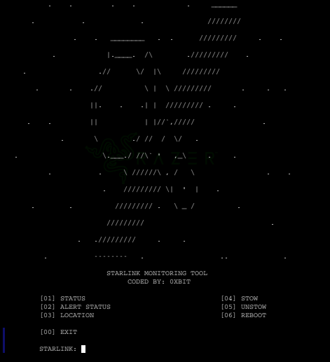
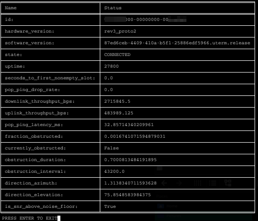
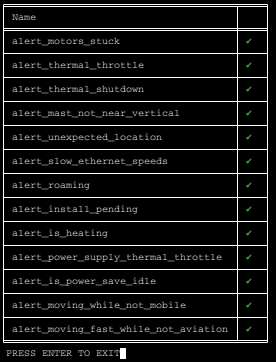
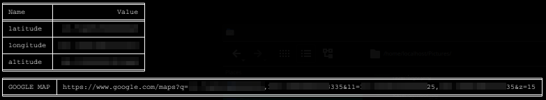

<h1 align="center"> DEDSEC_STARLINK </h1>
<h4 align="center">Dedsec-Starlink is a Terminal-Based Starlink Router Management and monitoring tool using Starlink API</h4>

### OPTIONS
 [01]. STATUS  -  DEVICE INFORMATION AND STATUS
 
 [02]. ALERT STATUS  -  DISH ALERT NOTIFICATION AND STATUS
 
 [03]. DISH LOCATION  -  DISH GPS LOCATION WITH GOOGLE MAP LINK
 
 [04]. STOW  -  STOW DISH
 
 [05]. UNSTOW   -  UNSTOW DISH
 
 [06]. REBOOT   -   REBOOT DISH

### SCREENSHOT

### INSTALLATION [ KALI - UBUNTU - TERMUX APP  ]
* git clone https://github.com/0xbitx/DEDSEC_STARLINK.git
* cd DEDSEC_STARLINK
* pip install --upgrade -r requirements.txt
* python3 dedsec_starlink.py

### TESTED ON FOLLOWING:-
* Kali Linux 
* Parrot OS 
* Ubuntu
* Termux App

### LANGUAGE 
* Python

<h1 align="center"> DISCLAIMER </h1>

<h4 align="center">I'm not responsible for anything you do with this program, so please only use it for good and educational purposes. </h4>

